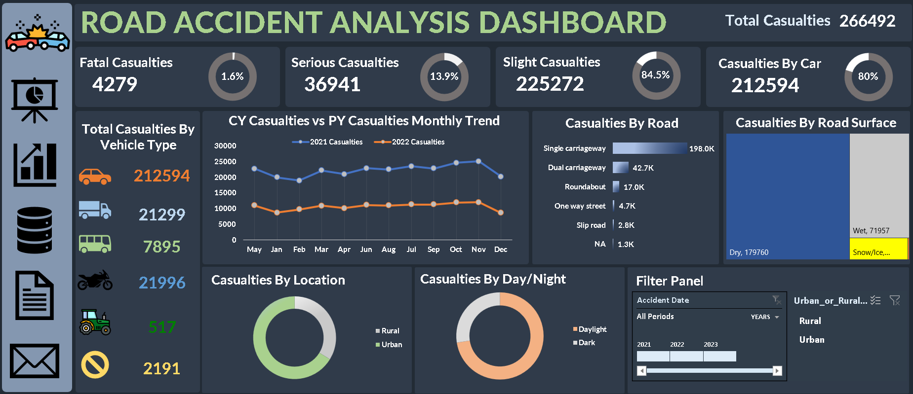

# 🚗 Road Accident Dashboard Project

Welcome to the **Road Accident Dashboard** project! This interactive dashboard provides deep insights into road accident patterns using powerful data visualization tools. The objective is to analyze accident data and uncover critical insights to help in road safety improvements and decision-making processes.

---

## 📊 Project Overview

This project leverages data analytics to:

- Analyze accident frequency across different states and time periods
- Visualize accident causes and severity levels
- Identify high-risk zones and accident hotspots
- Support authorities with data-driven decisions for road safety

---

## 🧰 Tools & Technologies Used

- **Microsoft Excel** – for data cleaning and analysis
- **Power BI** – for interactive dashboard creation
- **Data Source** – [Road Accident Dataset.xlsx](./Road%20Accident%20Dataset.xlsx)

---

## 📂 Files Included

| File Name                       | Description                          |
|--------------------------------|--------------------------------------|
| `Road Accident Dataset.xlsx`   | Raw dataset used for the project     |
| `Road Accident Dashboard.xlsx` | Final dashboard with visualizations  |

---

## 🌐 Dashboard Preview

> 📌 *(This ia a Dashboard of Road Accident)*

---

## 📈 Key Insights

- 🚧 **Most accidents** occurred in urban areas with high vehicle density  
- 🌙 **Night-time accidents** are significantly higher on highways  
- 🛣️ **Month-wise comparison** Like [November] Month has with the highest fatality rate  
- 🔍 **Human error** remains the top contributing factor in road accidents

---

## 📬 Contact & Connect

Feel free to connect with me for collaboration or feedback:

- 👤 **AMIT VERMA**  
- 📧 Email: [amytverma20@gmail.com]  
- 💼 LinkedIn: [https://www.linkedin.com/in/amitverma20/]

---

## ⭐ Acknowledgements

Thanks to the contributors of publicly available datasets and all tools used to make this project possible.

---

> 📝 *This project is a part of my academic work and showcases my data analysis and visualization skills.*

